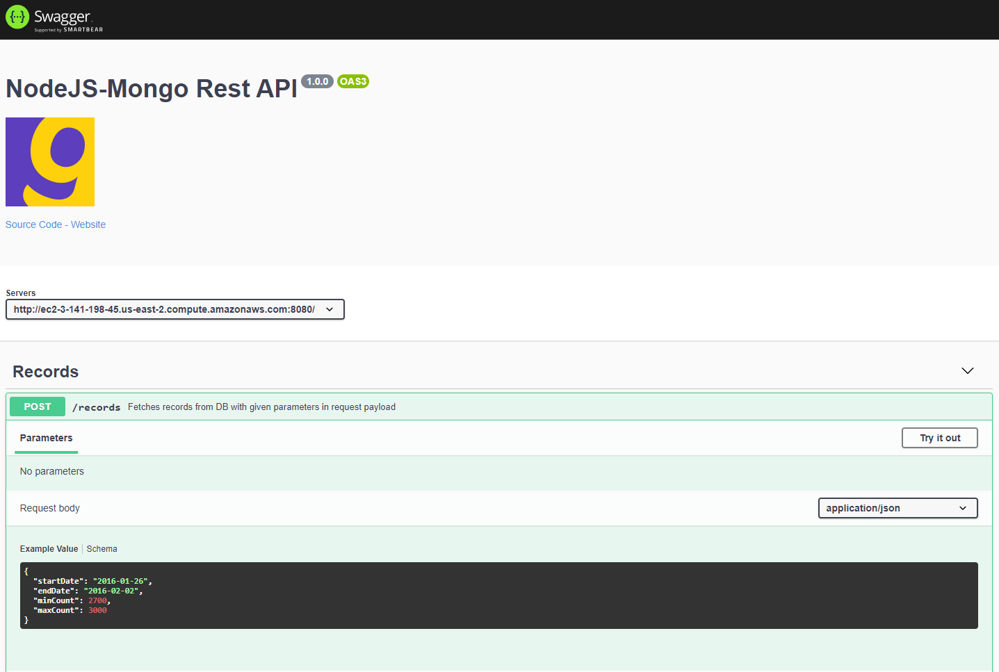
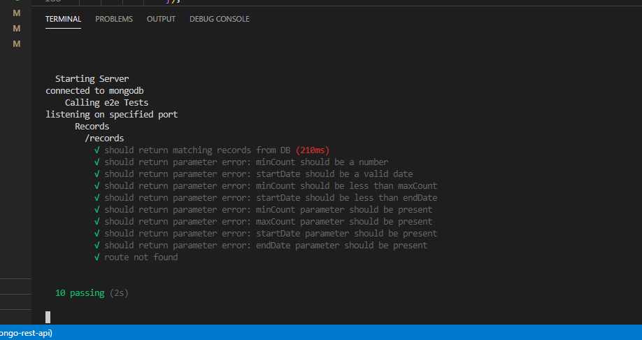

# NodeJS Rest API with (ExpressJS and MongoDB)

NodeJS based rest service application
<br>

# Installation

- Clone repository or download it manually
  
  ```bash
  git clone https://github.com/xbersoy/nodejs-mongo-rest-api
  ```
  
- Install dependencies

  ```bash
  npm install
  ```

- Start the application
  
  ```bash
  npm run start
  ```
  or with nodemon
  ```bash
  npm run watch
  ```
  
- Create a file name .env and specify port and database connection URL. Your .env file should look like below:
  ```bash
  PORT = 3000
  DB_CONNECTION_STRING = mongodb+srv://...
  ```
  That's all! Application should be running on your local. <br><br>
  To run tests
  ```bash
  npm test
  ```

## Install with docker

```bash
docker container run 
  -p <desired_port>:3000 burakersoy/nodejs-mongo-rest-api 
```
<br>

# Swagger
You can test see and test endpoint with swagger ui. <br>
http://ec2-3-141-198-45.us-east-2.compute.amazonaws.com:8080/api-docs

<br><br>

# AWS
Application has been deployed to aws and the container runs on a ec2 instance. You can use the link below.
http://ec2-3-141-198-45.us-east-2.compute.amazonaws.com:8080/

<br>

# Test Result

<br>
More tests can be added<br>
<br>

# Endpoints

### POST /records

URL: http://ec2-3-141-198-45.us-east-2.compute.amazonaws.com:8080/records

Returns data from MongoDB with parameters given in request body.
<br><br>

With curl
```bash
curl -X POST -H "Content-Type: application/json"     -d '{
"startDate": "2016-01-26",
"endDate": "2016-02-02",
"minCount": 2700,
"maxCount": 3000
}'     http://ec2-3-141-198-45.us-east-2.compute.amazonaws.com:8080/records
```

<br>

(With tools like Postman)
<br>
Sample Request Payload <br>
```bash
{
"startDate": "2016-01-26",
"endDate": "2016-02-02",
"minCount": 2700,
"maxCount": 3000
}
```

Successful Response Payload

```bash
{
    "code": 0,
    "msg": "Success",
    "records": [
        {
            "key": "bxoQiSKL",
            "createdAt": "2016-01-29T01:59:53.494Z",
            "totalCount": 2991
        },
        {
            "key": "NOdGNUDn",
            "createdAt": "2016-01-28T07:10:33.558Z",
            "totalCount": 2813
        }
    ]
}
```
<br>

Invalid Request Payload - 1 <br>

```bash
{
"startDate": "2016-01-26",
"endDate": "2016-02-02",
"minCount": "2700",
"maxCount": 3000
}
```

Error Response Payload - 1

```bash
{
    "code": 2,
    "msg": "Validation error - Invalid request parameters.",
    "details": [
        {
            "message": "minCount should be a number, not a string",
            "param": "minCount"
        }
    ]
}
```
<br>

Invalid Request Payload - 2 <br>

```bash
{
"startDate": "2016-01-26",
"endDate": "2016-02-02",
"minCount": "",
"maxCount": 3000
}
```

Error Response Payload - 2

```bash
{
    "code": 2,
    "msg": "Validation error - Invalid request parameters.",
    "details": [
        {
            "message": "minCount can not be empty!",
            "param": "minCount"
        }
    ]
}
```
<br>

Invalid Request Payload - 3 <br>

```bash
{
"startDate": "2016-01-26",
"endDate": "2016-02-02",
"minCount": 3200,
"maxCount": 3000
}
```

Error Response Payload - 3

```bash
{
    "code": 2,
    "msg": "Validation error - Invalid request parameters.",
    "details": [
        {
            "message": "minCount should be greater than maxCount",
            "param": "minCount"
        },
        {
            "message": "maxCount should be greater than minCount",
            "param": "maxCount"
        }
    ]
}
```
<br>

Invalid Request Payload - 4 <br>

```bash
{
"startDate": "2016-05asd-26",
"endDate": "2016-02-02",
"minCount": 2700,
"maxCount": 3000
}
```

Error Response Payload - 4

```bash
{
    "code": 2,
    "msg": "Validation error - Invalid request parameters.",
    "details": [
        {
            "message": "startDate must be a valid date",
            "param": "startDate"
        }
    ]
}
```

<br>

Invalid Request Payload - 5 <br>

```bash
{
"startDate": "2016-05-26",
"endDate": "2016-02-02",
"minCount": 2700,
"maxCount": 3000
}
```

Error Response Payload - 5

```bash
{
    "code": 2,
    "msg": "Validation error - Invalid request parameters.",
    "details": [
        {
            "message": "startDate should be less than endDate",
            "param": "startDate"
        }
    ]
}
```


<br>

Invalid endpoint sample - 6 <br>
URL : localhost:3000/test
```bash
{

}
```

Invaild endpoint response payload - 6

```bash
{
    "code": 3,
    "msg": "Route does not exist"
}
```
